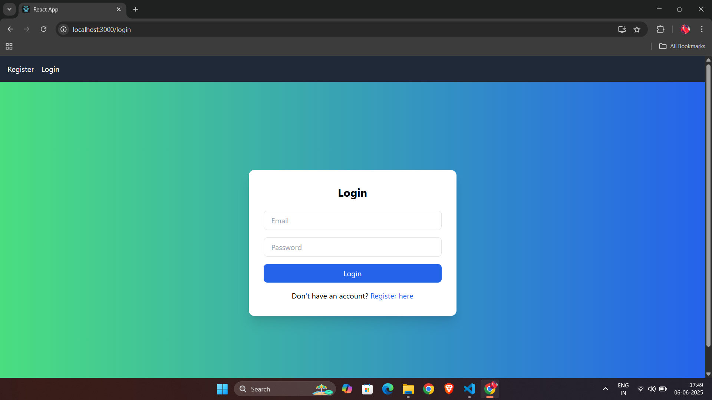
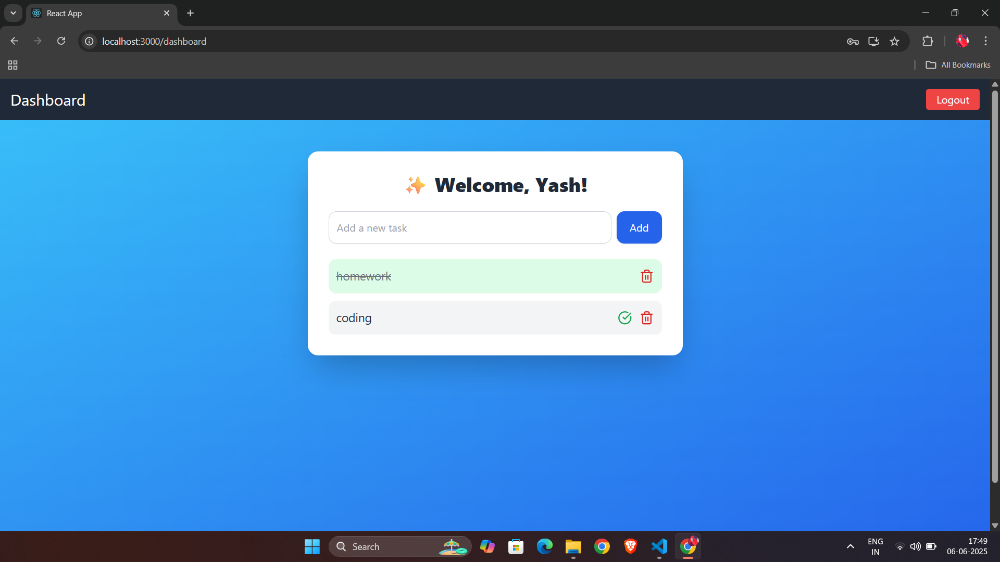

# 📝 To-Do App with Authentication

A full-stack To-Do List web application built using **React**, **Node.js**, **Express**, and **MongoDB**. Users can register, log in, and manage their personal to-dos with an intuitive interface.

## 🔥 Features

- ✅ User Registration & Login (Authentication)
- 📋 Add, View, Mark as Done, and Delete Tasks
- 🔐 Protected Dashboard
- 💾 Tasks stored persistently in MongoDB
- 🎨 Responsive & modern UI with Tailwind CSS

---

## 📸 Screenshots

|      Login Page        |               Register               |              Dashboard             | 
|------------|-----------|--------------|
|  |  |  |


---

## 🚀 Getting Started

### ⚙️ Backend Setup

1. Navigate to the backend folder:
   ```bash
   -cd backend
2.Install dependencies
```bash
   -npm install
```
3. Create a .env file
   ```ini
-MONGO_URI=your_mongodb_connection_string
-PORT=5000
```
5. Start the server
    -node index.js
### Frontend Setup
1. Navigate to the frontend folder
    -cd frontend
2. Install dependencies
     -npm install
3. Start the react developement server
     -npm start

🛠️ Tech Stack
Frontend: React, Tailwind CSS, Axios, React Router DOM
Backend: Node.js, Express.js, MongoDB, Mongoose
Database: MongoDB Atlas (or Local MongoDB)

project/
│
├── backend/
│   ├── models/
│   ├── routes/
│   └── server.js
│   
├── frontend/
│   ├── src/
│   │   ├── components/
│   │   └── App.js
│   └── tailwind.config.js
